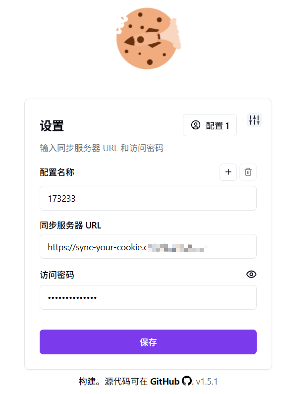
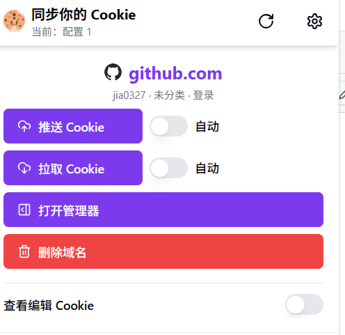
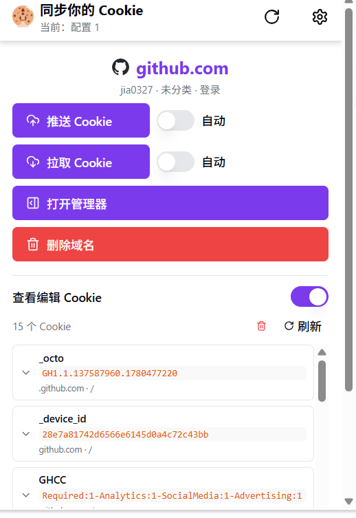
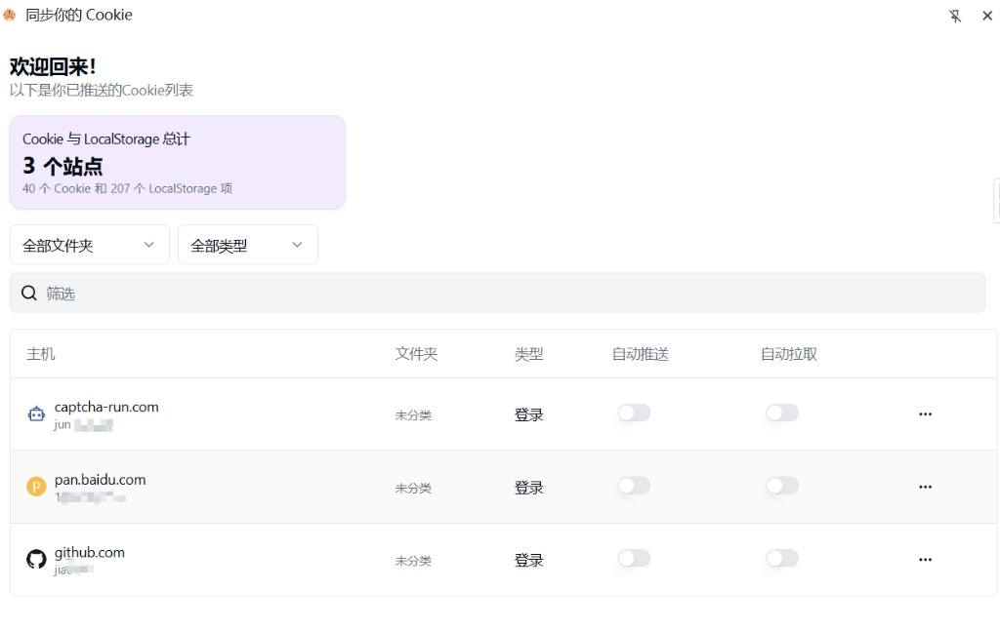
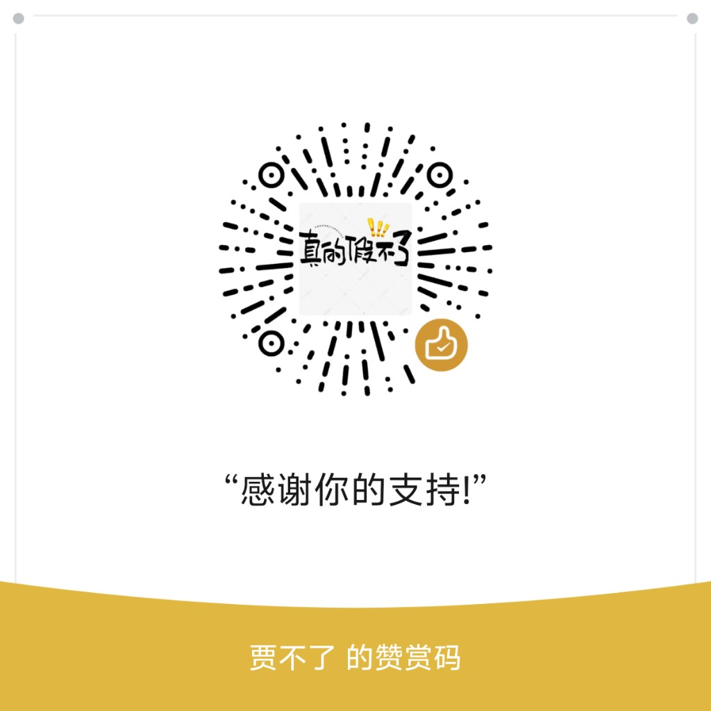

<div align="center">

<h1>Sync Your Cookie</h1>
<p>将浏览器 Cookie 与 LocalStorage 同步到 Cloudflare KV — 跨设备、跨浏览器共享登录态。</p>


</div>

[English](./README_EN.md) | [中文](./README.md)

**Sync Your Cookie** 是一款 Chromium 扩展（Chrome、Edge 及兼容浏览器），可将 Cookie 与 LocalStorage 同步到 **Cloudflare KV**。在不同设备间共享登录会话、为同一站点管理多个账号，并可选择部署 **Cloudflare Worker** 后端与密码保护的 Web 管理端。

> **说明（v1.7.x）：** 已移除 GitHub Gist 与扩展内直连 KV（Account ID / Token）。扩展**仅通过 Worker**（服务器 URL + 访问密码）同步；KV 凭据在 Web 管理端 Connect 表单配置一次即可。

### 与原版对比

基于上游 [jackluson/sync-your-cookie](https://github.com/jackluson/sync-your-cookie) 的 fork，主要增强如下：

| 能力 | 原版 | 本 fork |
|------|------|---------|
| 同步方式 | Gist 或扩展内填 KV 凭据 | **Worker URL + 密码**（v1.7.0 移除扩展直连 KV） |
| 同站多账号 | 单条目 | 多账号 + **切换并拉取**（v1.5.8） |
| 账号元数据 | 备注 | 首次 Push 备注 + **文件夹 / 类型**（login / session / other） |
| Pull | 基础覆盖 | **镜像同步**（先应用远程再清理多余项）+ 操作前**自动刷新**连接 |
| Cookie 编辑 | 侧边栏 | 弹窗完整编辑器 + 复制 **Cookie 头 / JSON**（v1.5.6–1.5.7） |
| 部署 | 手动配置 KV | **Git 连 Cloudflare** 一键部署 Worker；支持 `WEB_BASE_PATH` 自定义路径 |
| 安全 | — | v1.6.0 消息校验、凭据本地化、Worker 限流 / 会话 / CORS / 加密默认 |
| 错误提示 | 通用失败 | v1.6.1–1.6.3 显示 HTTP 状态与服务器响应，Pull 逐条跳过原因 |

### 安装

本 fork **未单独上架商店**。请从 **[GitHub Releases](https://github.com/cf-fork-div/sync-your-cookie/releases)** 下载 `sync-your-cookie-{version}.zip`，解压后在浏览器扩展页加载。完整步骤见 [how-to-use.md — 获取与安装](./how-to-use.md#获取与安装)。


| 方式 | 说明 |
|------|------|
| **Release ZIP（推荐）** | [Releases](https://github.com/cf-fork-div/sync-your-cookie/releases) 下载最新 `sync-your-cookie-{version}.zip` |
| 从源码构建 | `pnpm build` 后加载 `dist/`，见 [安装配置](#安装配置) |
| 上游商店（原版） | [Chrome](https://chromewebstore.google.com/detail/sync-your-cookie/bcegpckmgklcpcapnbigfdadedcneopf) · [Edge](https://microsoftedge.microsoft.com/addons/detail/sync-your-cookie/ohlcghldllgnmkegocpcphdbbphikgfm) — 上游版本，非本 fork 发布 |

### 功能

#### 同步与存储
- 同步 **Cookie** 与 **LocalStorage** 到 Cloudflare KV（protobuf 编码）
- **跨浏览器同步** — 同一后端可在 Chrome、Edge 等 Chromium 浏览器间使用
- **Worker 连接：** 服务器 URL + 访问密码 → `/api/sync/*`
- **Pull 镜像远程** — 先应用远程 Cookie，再移除多余项；完整还原 hostOnly/第三方 Cookie（v1.5.3–1.5.5）
- **Push 采集一致** — Push 与 Cookie 编辑器共用采集逻辑，不遗漏 hostOnly Cookie（v1.5.2）
- 按站点配置 **Auto Push** 与 **Auto Pull**

#### 多账号与元数据
- **同域名多账号** — 同一 host 下多条记录，各自带标签
- **文件夹与类型** — Bitwarden 风格文件夹；类型：login / session / other
- **`entryMetaMap` 同步** — 标签、文件夹、类型随 Cookie 数据一并同步
- **首次 Push** 需填写账号备注（无远程记录时）
- **Push 冲突对话框** — 覆盖已有条目或另存为新账号

#### 界面与管理
- **Bitwarden 风格登录** — 弹窗/侧边栏输入配置名、服务器 URL、密码
- **操作前自动刷新** — Push、Pull、打开管理器前先验证服务器连接
- **弹窗 Cookie 查看/编辑** — 增删改、复制值/JSON/Cookie 头、一键清空与刷新（v1.5.6–1.5.7）
- **侧边栏管理器** — 完整 Cookie 与 LocalStorage 详情
- **Web 管理端** — 可选 Worker 部署；界面与侧边栏对齐（搜索、文件夹/类型筛选）
- **多账户配置（Account Profiles）** — 每套配置独立凭据与域名规则
- **国际化** — 英文与简体中文（`en`、`zh_CN`）
- **版本显示** — 弹窗底部与 Options 页显示当前版本（如 `v1.7.1`）

#### 安全

- 凭据与加密密码仅存于本地（不同步至 Chrome Sync）；详见 [docs/SECURITY.md](./docs/SECURITY.md)

#### Cloudflare Worker 后端

Git 连接 Cloudflare 部署 Worker（Web 管理端 + 同步 API），扩展用 Worker URL + 密码登录。部署见 [deploy/CLOUDFLARE.md](./deploy/CLOUDFLARE.md)，参数准备见 [deploy/CLOUDFLARE-PARAMS.md](./deploy/CLOUDFLARE-PARAMS.md)。

### 截图

设置 — 同步服务器 URL 与访问密码



弹窗 — 当前站点 Push/Pull 同步



弹窗 — Cookie 列表、编辑与复制（Cookie 头 / JSON）



侧边栏 — 站点列表与文件夹/类型筛选



### 安装配置

1. 从 [GitHub Releases](https://github.com/cf-fork-div/sync-your-cookie/releases) 下载 ZIP 并加载扩展，或 `pnpm build` 后加载 `dist/` — 见 [how-to-use.md](./how-to-use.md)。
2. 按 [deploy/CLOUDFLARE.md](./deploy/CLOUDFLARE.md) 连接 Git 部署 Worker，设置 `WEB_ACCESS_PASSWORD`。
3. 扩展弹窗用 Worker URL + 密码登录 — 功能与场景见 [how-to-use.md](./how-to-use.md)。

#### 从源码构建

```bash
pnpm install
pnpm dev          # 开发模式（HMR）
pnpm build        # 生产构建 → dist/
pnpm release:zip  # 商店用 zip → dist/release/
```

### 使用指引

1. **登录** — Worker URL + 密码。
2. **Push** — 上传当前标签页 Cookie（与远程不一致时弹出冲突对话框）。
3. **Pull** — 下载远程 Cookie；先应用远程数据，再移除多余项（镜像同步）。
4. **打开管理器** — 侧边栏查看完整 Cookie/LocalStorage。
5. **Web 管理端**（可选） — 浏览器打开 Worker URL，界面与侧边栏一致。

**文档导航：** [how-to-use.md](./how-to-use.md)（[安装](./how-to-use.md#获取与安装) · [登录与同步](./how-to-use.md#登录与同步) · [使用场景](./how-to-use.md#使用场景与推荐配置)） · Worker 部署：[deploy/CLOUDFLARE.md](./deploy/CLOUDFLARE.md) · 部署参数：[deploy/CLOUDFLARE-PARAMS.md](./deploy/CLOUDFLARE-PARAMS.md) · 下载：[GitHub Releases](https://github.com/cf-fork-div/sync-your-cookie/releases)

### 更新日志

| 版本 | 要点 |
|------|------|
| **1.7.1** | Release ZIP 分发；文档与部署流程完善 |
| **1.7.0** | 移除扩展直连 KV；仅 Worker URL + 密码同步 |
| **1.6.3** | 已设 serverUrl 时优先走 Worker 路径 |
| **1.6.2** | 登录时同步 server 存储键；改进 Pull 错误提示 |
| **1.6.1** | 验证失败显示 HTTP 状态与服务器响应体 |
| **1.6.0** | 安全加固：消息校验、hostname 匹配、本地凭据、Worker 限流/会话/CORS、加密默认 |
| **1.5.8** | Popup「切换并拉取」多账号一键拉取 |
| **1.5.6** | 弹窗 Cookie 编辑器：增删改、复制值/JSON |
| **1.5.5** | Pull 部分失败不丢 Cookie；sameSite 修复 |
| **1.5.4** | 侧边栏 Pull 不再归零；跳过失败 Cookie 并提示 |
| **1.5.3** | Pull 完整还原 hostOnly/第三方 Cookie |
| **1.5.2** | Push 采集与编辑器对齐，不遗漏 hostOnly Cookie |
| **1.5.1** | Push 对话框支持文件夹/类型；entry meta UI 统一 |
| **1.5.0** | Worker 同步后端、Bitwarden 风格登录、同域名多账号、Push 冲突、Pull 镜像、弹窗 Cookie 编辑、Web 管理端对齐 |

完整记录：[CHANGELOG.md](./CHANGELOG.md)

### 隐私政策

详见 [隐私政策](./private-policy.md)。

### 赞赏 / 支持

<div align="center">

感谢你的支持



微信赞赏码

</div>
