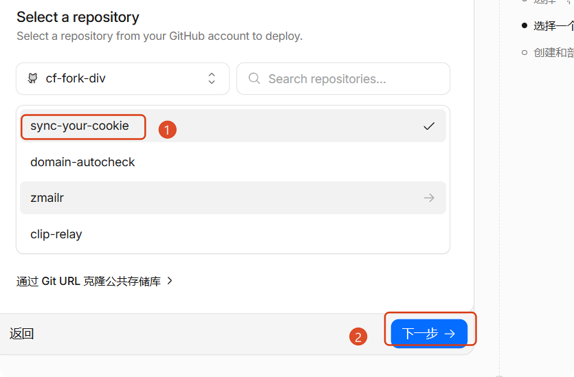
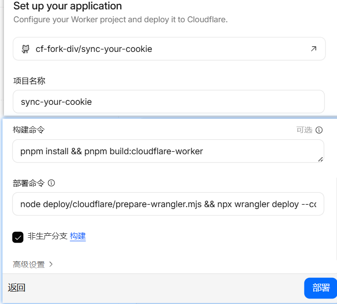

# Cloudflare 部署指南

## 介绍

**Sync Your Cookie** 通过自建的 **Cloudflare Worker + KV** 后端，配合 **Web 管理端**与**浏览器扩展**，在多台设备、多个浏览器之间同步 Cookie 与 LocalStorage。

**解决什么痛点**

- **多设备 / 多浏览器**登录态不一致，换机或换浏览器就要重新登录
- **数据自主**：不依赖第三方 Cookie 同步服务，Cookie 存在你自己 Cloudflare 账号下的 Worker + KV
- **扩展配置简单**（v1.7.x）：只需 **Worker URL + 访问密码**，不必在插件里填 Account ID / Namespace / Token；KV 凭据在 Web 管理端 Connect 表单配置一次即可
- **运维轻量**：Git 连接后 **push 即自动构建部署**
- **同步可控**：支持同站多账号、手动 Push / Pull；多账号推荐 **切换并拉取**（见 [how-to-use.md](../how-to-use.md#使用场景与推荐配置)）

下文为 Worker 部署 checklist。

## 前置条件

- [ ] Cloudflare 账号，Git 仓库已授权
- [ ] Node.js **20+**
- [ ] 对本仓库有 push 权限（或 fork 后连接 fork）
- [ ] 已创建 KV 命名空间并记录 **Namespace ID**（见下）
- [ ] 已创建 API Token 并记录 **Token 字符串**（见下）

### 创建 Workers KV 命名空间

Namespace ID 用于 Build 变量 `SYNC_KV_NAMESPACE_ID`，以及部署后 Web 管理端 Connect 表单。

1. [Cloudflare Dashboard](https://dash.cloudflare.com/) → **Workers & Pages** → **KV** → **创建命名空间**
2. 名称填 **`sync-your-cookie`**，点击 **创建**
3. 在命名空间详情页复制 **Namespace ID**（稍后填入 Build 变量与 Connect 表单）


### 创建 API Token（Connect 表单用）

此 Token 供 **Web 管理端 Connect 表单**使用，Worker 通过它读写 **Cookie 存储 KV**（需 **Workers KV Storage:Edit** 权限）。

> **与 Build 自动注入的 Token 区分**：Git 连接部署时，Cloudflare Builds 会自动注入 `CLOUDFLARE_API_TOKEN` 供 `wrangler deploy` 与 `prepare-wrangler.mjs` 使用，**无需**手动添加到 Build 变量。本节创建的 Token 由你自行保管，部署完成后填入 Connect 表单；若设置了 `DEPLOY_SEED_DATASOURCE=1`，Build 会用自动注入的 Token 预写 Connect 配置，但仍建议保存一份备用。

1. Dashboard → **我的个人资料** → **API 令牌** → **创建令牌**
2. 在模板列表选择 **编辑 Cloudflare Workers**，点击 **使用模板**
3. 令牌名称填 **`sync-your-cookie`**
4. 确认权限包含 **Workers KV Storage:Edit** 后，点击 **创建令牌**
5. 复制生成的 Token（`cfut_...`），关闭页面前妥善保存


## 部署步骤

### 1. 创建 Worker（Git 连接）

1. [Cloudflare Dashboard](https://dash.cloudflare.com/) → **Workers & Pages** → **Create** → **Workers** → **Connect to Git**
2. 在仓库列表中选择 **sync-your-cookie**，点击 **下一步**



3. **项目名称** = `sync-your-cookie`（须与 `deploy/cloudflare/wrangler.toml` 中 `name` 一致）
4. 填写 **构建命令** 与 **部署命令**（见第 2、3 节及下图），勾选 **非生产分支构建**（可选）
5. Node.js 版本选 **20**（**高级设置** 中）

### 2. Build 变量（Settings → Build → Build variables and secrets）

| 变量 | 类型 | 说明 |
|------|------|------|
| `SYNC_KV_NAMESPACE_ID` | Variable | 前置条件中创建的 Namespace ID（固定绑定，redeploy 不换绑） |
| `WEB_ACCESS_PASSWORD` | Secret | Web / 扩展登录密码（Deploy 时由 prepare-wrangler 推送到 Worker） |

可选 Build Variable：

| 变量 | 说明 |
|------|------|
| `WEB_BASE_PATH` | 自定义 URL 路径段，如 `my-vault` → 访问 `/my-vault/` |
| `DEPLOY_SEED_DATASOURCE=1` | 首次 Deploy 自动将 KV 凭据写入 SYNC_KV（免手动 Connect）；已有配置时用 `force` 覆盖 |

`CLOUDFLARE_API_TOKEN` 由 Cloudflare Builds **自动注入**，无需手动添加。

### 3. Build / Deploy 命令



| 项 | 值 |
|----|-----|
| Root directory | `/` |
| Build command | `pnpm install && pnpm build:cloudflare-worker` |
| Deploy command | `node deploy/cloudflare/prepare-wrangler.mjs --deploy` |

同等写法（无需 `--deploy` 参数时可用）：

```bash
node deploy/cloudflare/prepare-wrangler.mjs && cd deploy/cloudflare && npx wrangler deploy
```

> 勿使用 `… && npx wrangler deploy --config deploy/cloudflare/wrangler.toml`：Dashboard 部署命令字段可能截断路径（如 `.toml` 变成 `.tom`），导致 Wrangler 读不到配置并报 `Missing entry-point`。应在 `deploy/cloudflare` 目录内执行 `wrangler deploy`（`--deploy` 脚本会自动 `cd`）。
>
> Git 仓库须为包含上述脚本的 fork（如 `cf-fork-div/sync-your-cookie`）。仅改 Dashboard 命令、未 push 新代码就 Retry，会报 `Cannot find module deploy-ci.mjs`。

### 4. 保存并部署

**Save and Deploy** 或向连接分支 push，等待 Build + Deploy 完成。

## 密码：Build Secret vs Production Secret

| 位置 | 何时生效 | 说明 |
|------|----------|------|
| **Build → Secrets** `WEB_ACCESS_PASSWORD` | 每次 Deploy | `prepare-wrangler.mjs --deploy` 自动执行 `wrangler secret put` |
| **Worker → Variables and Secrets → Production** | **立即** | 改密码无需 rebuild / redeploy |

日常改密码：在 **Production** 修改即可。首次部署或 CI 未注入密码时，在 Build Secrets 添加并 redeploy。

## 自定义域名（可选）

1. Worker → **Settings → Domains & Routes** → **Add Custom Domain**
2. 例如 `sync-your-cookie.onlydev.ccwu.cc`
3. 扩展 **服务器 URL** 填 `https://sync-your-cookie.onlydev.ccwu.cc`（无尾斜杠）
4. 若设置了 `WEB_BASE_PATH`，URL 需带前缀，如 `https://…/my-vault`

`workers.dev` 子域与自定义域名可并存；扩展填实际使用的地址即可。

## 部署后

### Web 管理端

- [ ] 打开 Worker URL（或自定义域名），输入 `WEB_ACCESS_PASSWORD` 登录
- [ ] **Connect 表单**：填写 **Account ID**、**Namespace ID**（同上）、**API Token**（前置条件中创建的 `cfut_...` Token），保存
- [ ] 若 Build 时设置了 `DEPLOY_SEED_DATASOURCE=1` 且 Deploy 成功，Connect 通常已自动配置

Connect 中的 KV 为 **Cookie 存储**；`SYNC_KV` 存 datasource 配置等 Worker 元数据（可与 Cookie KV 为同一 Namespace）。

### 扩展（v1.7.x）

弹窗或侧边栏填写 **服务器 URL**（Worker 根地址，无尾斜杠）与 **访问密码**（同上）。登录后即可 Push / Pull / **切换并拉取**。详见 [how-to-use.md](../how-to-use.md#使用场景与推荐配置)。

## 后续更新

向 Git 连接分支 **push 即自动 redeploy**；`SYNC_KV_NAMESPACE_ID` 不变时 KV 数据保留。

## 常见问题

**Deploy 报 `Cannot find module … deploy-ci.mjs`？**
- 当前构建用的 **Git commit 过旧**，或 Cloudflare 连的不是已 push 的 fork
- **立即修复**：Deploy command 改为  
  `node deploy/cloudflare/prepare-wrangler.mjs && cd deploy/cloudflare && npx wrangler deploy`  
  （不依赖 `deploy-ci.mjs`，适用于较早 commit）
- 向连接分支 **push 最新代码** 后，可改用：  
  `node deploy/cloudflare/prepare-wrangler.mjs --deploy`

**Deploy 报 `Missing entry-point to Worker script or to assets directory`？**
- 多为 **Deploy command 路径被截断**（`wrangler.toml` 写成 `wrangler.tom`），Wrangler 未加载任何配置
- 将 Deploy command 改为：`node deploy/cloudflare/prepare-wrangler.mjs --deploy`（或上一节的 `&& cd deploy/cloudflare` 写法），保存后 **Retry deployment**

**无法登录 / 「未配置访问密码」？**
- 确认 Build Secrets 或 Production 中已设置 `WEB_ACCESS_PASSWORD`
- 若 Build 未注入：添加 Build Secret 后 redeploy，或直接在 Production 设置

**redeploy 后 Connect 表单要重填？**
- Build variables **固定 `SYNC_KV_NAMESPACE_ID`**
- Deploy 命令使用 `prepare-wrangler.mjs --deploy`（内含 KV 绑定与 Secret 推送）
- 或设置 `DEPLOY_SEED_DATASOURCE=1` 自动恢复

**Push/Pull「验证失败」/`verify_failed`？**（v1.6.1+ 会显示 HTTP 状态与响应体）

| 原因 | 处理 |
|------|------|
| Worker 版本过旧 | push 触发 redeploy 到 v1.6.0+ |
| 密码不匹配 | Production 确认密码；扩展重新保存 |
| URL 错误 | 填根地址，不带 `/api`；有 `WEB_BASE_PATH` 则带前缀 |
| `datasource_not_configured` | Web 管理端 Connect 表单保存 KV 凭据，或 `DEPLOY_SEED_DATASOURCE=1` |
| `network_error` | 检查 URL、域名 DNS、Worker 是否在线 |

**Pull 失败 / 部分 Cookie 未写入？**
- Toast 会显示 `name@domain: reason`（v1.5.5+）
- 第三方 Cookie 可能被浏览器策略跳过，属正常

**「切换并拉取」失败？**（v1.7.1 修复同站多账号 URL 解析）
- 确认扩展 ≥ v1.7.1
- 先手动 Pull 验证连接；仍失败则检查 datasource 与密码

**本地调试 Worker？**

```bash
pnpm build:cloudflare-worker
cd deploy/cloudflare && npx wrangler dev
```
