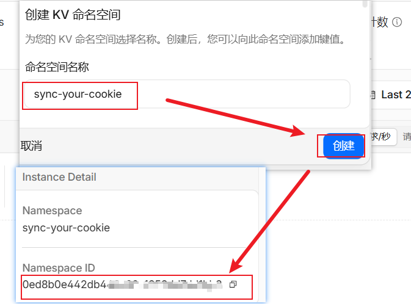
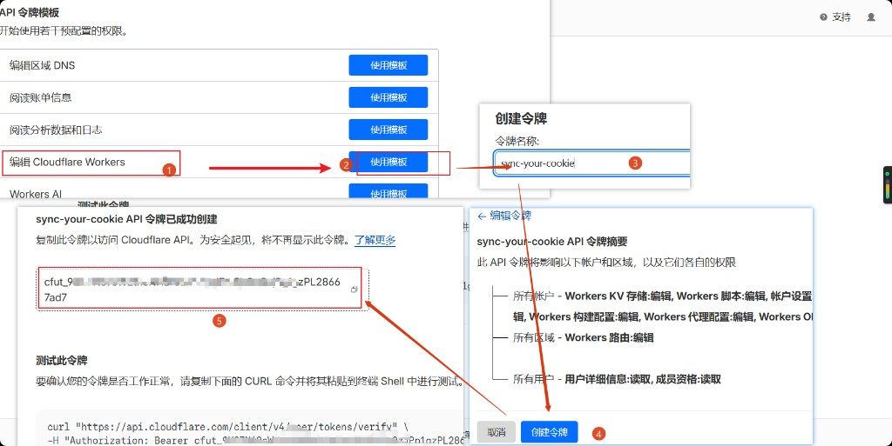

# Cloudflare 部署指南

## 介绍

**Sync Your Cookie** 通过自建的 **Cloudflare Worker + KV** 后端，配合 **Web 管理端**与**浏览器扩展**，在多台设备、多个浏览器之间同步 Cookie 与 LocalStorage。

**解决什么痛点**

- **多设备 / 多浏览器**登录态不一致，换机或换浏览器就要重新登录
- **数据自主**：不依赖第三方 Cookie 同步服务，Cookie 存在你自己 Cloudflare 账号下的 Worker + KV
- **扩展配置简单**（v1.7.x）：只需 **Worker URL + 访问密码**；KV 凭据在 Web 管理端 Connect 表单配置一次即可
- **运维轻量**：Git 连接后 **push 即自动构建部署**
- **同步可控**：支持同站多账号、手动 Push / Pull；多账号推荐 **切换并拉取**（见 [how-to-use.md](../how-to-use.md#使用场景与推荐配置)）

---

## 前置条件

在 Cloudflare Dashboard 创建 Worker 之前，确认：

- [ ] **Cloudflare 账号**，且 GitHub 已授权 Cloudflare
- [ ] 对本仓库 **fork 有 push 权限**（须连接你实际 push 代码的 fork，勿连未同步的上游仓库）
- [ ] 本地或 CI 构建使用 **Node.js 20**（Dashboard **高级设置** 中同样选 20）
- [ ] Worker **项目名称** 填 **`sync-your-cookie`**（须与 `deploy/cloudflare/wrangler.toml` 中 `name` 一致）
- [ ] **Root directory** 填 **`/`**

---

## 前置参数获取

进入 Worker 创建页之前，先准备好以下 **4 个 Build 变量**：

| 参数名称 | 说明 | 是否加密 | 参数来源 |
|----------|------|----------|----------|
| `SYNC_KV_NAMESPACE_ID` | KV 命名空间 ID，绑定 Worker 元数据存储 | 否（Variable） | [创建 KV 命名空间](#创建-kv-命名空间) 后复制 |
| `CLOUDFLARE_API_TOKEN` | Cloudflare API Token（`cfut_...`），用于部署与 Connect 自动配置 | 是（Secret） | [创建 API Token](#创建-api-token) |
| `WEB_ACCESS_PASSWORD` | Web 管理端与扩展登录密码 | 是（Secret） | 自行设定强密码 |
| `DEPLOY_SEED_DATASOURCE` | 填 `1`：首次 Deploy 自动写入 Connect 配置；覆盖已有填 `force` | 否（Variable） | 固定填 `1` |

> 设置 `DEPLOY_SEED_DATASOURCE=1` 且配置了 `CLOUDFLARE_API_TOKEN` 后，Deploy 会**自动解析 Account ID** 并写入 Connect 表单，**无需**手动复制 Account ID。仅当未设置 `DEPLOY_SEED_DATASOURCE`、需部署后手动填 Connect 表单时，才要在 Dashboard 右侧边栏查找 Account ID。

### 创建 KV 命名空间

1. Dashboard → **Workers & Pages** → **KV** → **创建命名空间**
2. 名称填 **`sync-your-cookie`**，点击 **创建**
3. 在命名空间详情页复制 **Namespace ID** → 填入 `SYNC_KV_NAMESPACE_ID`



### 创建 API Token

Token 用于部署脚本与 Connect 自动配置，需含 **Workers KV Storage:Edit** 权限，填入 Secret **`CLOUDFLARE_API_TOKEN`**。

1. Dashboard → **我的个人资料** → **API 令牌** → **创建令牌**
2. 选择 **编辑 Cloudflare Workers** 模板 → **使用模板**
3. 名称填 **`sync-your-cookie`**
4. 确认含 **Workers KV Storage:Edit** → **创建令牌**
5. 复制 `cfut_...`，关闭页面前保存



### 准备 Web 访问密码

自定强密码，填入 Build Secret **`WEB_ACCESS_PASSWORD`**。日常改密码可在 Worker → **Variables and Secrets → Production** 修改，**立即生效**、无需 rebuild；删服务重部署时须在 Build Secrets **重新添加**。

---

## 部署图文流程

先完成 [前置参数获取](#前置参数获取)，进入 Worker 创建页后 **一次性填完** 下表全部项，**再点第一次「部署」**。


| 步骤 | 操作 |
|------|------|
| **1** | 选择 **Git 账户 / 仓库**（须为你 push 代码的 fork，示例 `cf-fork-div/sync-your-cookie`） |
| **2** | **项目名称** 填 **`sync-your-cookie`** |
| **3** | **构建命令**：`pnpm install && pnpm build:cloudflare-worker` |
| **4** | **部署命令**：`node deploy/cloudflare/prepare-wrangler.mjs --deploy` |
| **5** | **高级设置**：Root directory **`/`**，Node.js **20** |
| **6** | Variable **`DEPLOY_SEED_DATASOURCE`** = **`1`** |
| **7** | Secret **`WEB_ACCESS_PASSWORD`** |
| **8** | Variable **`SYNC_KV_NAMESPACE_ID`** |
| **9** | Secret **`CLOUDFLARE_API_TOKEN`** |
| **10** | 点击 **部署**，在 Deployments 页等待 **Build** 与 **Deploy** 均成功 |

**命令（原样复制）**

```text
pnpm install && pnpm build:cloudflare-worker
```

```text
node deploy/cloudflare/prepare-wrangler.mjs --deploy
```

若报 `Unknown option '--deploy'`（代码过旧），部署命令改用：

```text
node deploy/cloudflare/prepare-wrangler.mjs && cd deploy/cloudflare && npx wrangler deploy
```

**注意**

- **勿用**带 `--config deploy/cloudflare/wrangler.toml` 的长命令：Dashboard 可能把 `.toml` 截断导致 `Missing entry-point`
- **勿**只对旧 Deployment 点 Retry；改命令后须 **Save and Deploy** 或 **向 Git push** 触发新构建
- 可选 Variable **`WEB_BASE_PATH`**：自定义 URL 路径段（如 `my-vault` → 访问 `/my-vault/`）
- 删除旧 Worker 后重建时，**KV 与 API Token 可保留**；删除 Worker 不会清空 KV 里的 Cookie 数据

---

## 验证

部署成功后按下列清单检查。

### Web 管理端

- [ ] 打开 Worker URL（`https://sync-your-cookie.<子域>.workers.dev`）
- [ ] 用 `WEB_ACCESS_PASSWORD` 登录
- [ ] 若未设置 `DEPLOY_SEED_DATASOURCE=1`：在 **Connect 表单** 填写 Account ID、Namespace ID、API Token 并保存
- [ ] 若设置了 `DEPLOY_SEED_DATASOURCE=1` 且 Deploy 成功：Connect 通常已自动配置

Connect 中的 KV 为 **Cookie 存储**；`SYNC_KV` 存 datasource 等 Worker 元数据（可与 Cookie KV 为同一 Namespace）。

### 浏览器扩展（v1.7.x）

- [ ] **服务器 URL**：Worker 根地址，无尾斜杠（有 `WEB_BASE_PATH` 则带前缀）
- [ ] **访问密码**：与 `WEB_ACCESS_PASSWORD` 相同
- [ ] 试一次 Push / Pull

### 后续更新

向 Git 连接分支 **push 即自动 redeploy**。`SYNC_KV_NAMESPACE_ID` 不变时 KV 数据保留。

### 自定义域名（可选）

1. Worker → **Settings → Domains & Routes** → **Add Custom Domain**
2. 例如 `sync-your-cookie.example.com`
3. 扩展 **服务器 URL** 填 `https://sync-your-cookie.example.com`（无尾斜杠）
4. 若设置了 `WEB_BASE_PATH`，URL 需带前缀，如 `https://…/my-vault`

`workers.dev` 与自定义域名可并存；扩展填实际使用的地址即可。

---

## 常见问题

**Deploy 报 `Missing entry-point`？**

- Deploy 命令被截断（`wrangler.toml` → `wrangler.tom`）或未在 `deploy/cloudflare` 目录执行 wrangler
- 改为：`node deploy/cloudflare/prepare-wrangler.mjs --deploy`，**Save and Deploy** 或 push 触发新构建

**Deploy 报 `Cannot find module`？**

- Cloudflare 连的仓库/分支没有最新代码，或对旧 Deployment 点了 Retry
- 确认 Git 仓库与 push 的 fork 一致，push 最新 `main` 后再部署

**Build 成功、Deploy 失败？**

- 检查 Deploy 命令是否与 [部署图文流程](#部署图文流程) 一致
- 确认 Build Secret 已设 `WEB_ACCESS_PASSWORD`
- 确认 `SYNC_KV_NAMESPACE_ID` 与 KV 命名空间 ID 一致

**无法登录 / 「未配置访问密码」？**

- Build Secrets 或 Production 中设置 `WEB_ACCESS_PASSWORD`
- 删服务重部署后须 **重新添加** Build Secret

**redeploy 后 Connect 表单要重填？**

- Build variables 固定 **`SYNC_KV_NAMESPACE_ID`**
- Deploy 使用 `prepare-wrangler.mjs --deploy`
- 或设置 `DEPLOY_SEED_DATASOURCE=1` 自动恢复

**Push/Pull「验证失败」/`verify_failed`？**（v1.6.1+ 会显示 HTTP 状态与响应体）

| 原因 | 处理 |
|------|------|
| Worker 版本过旧 | push 触发 redeploy |
| 密码不匹配 | Production 确认密码；扩展重新保存 |
| URL 错误 | 填根地址，不带 `/api`；有 `WEB_BASE_PATH` 则带前缀 |
| `datasource_not_configured` | Web Connect 表单保存 KV 凭据，或 `DEPLOY_SEED_DATASOURCE=1` |
| `network_error` | 检查 URL、DNS、Worker 是否在线 |

**Pull 失败 / 部分 Cookie 未写入？**

- Toast 会显示 `name@domain: reason`（v1.5.5+）
- 第三方 Cookie 可能被浏览器策略跳过，属正常

**「切换并拉取」失败？**（v1.7.1 修复同站多账号 URL 解析）

- 确认扩展 ≥ v1.7.1
- 先手动 Pull 验证连接

**本地调试 Worker？**

```bash
pnpm build:cloudflare-worker
cd deploy/cloudflare && npx wrangler dev
```

**本地一键部署（非 Git CI）？**

```bash
pnpm deploy:cloudflare
```

见 `deploy/cloudflare/.env.example` 配置 `CLOUDFLARE_API_TOKEN` 等。
