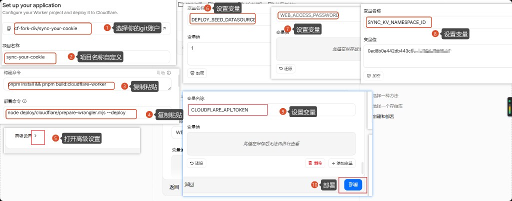
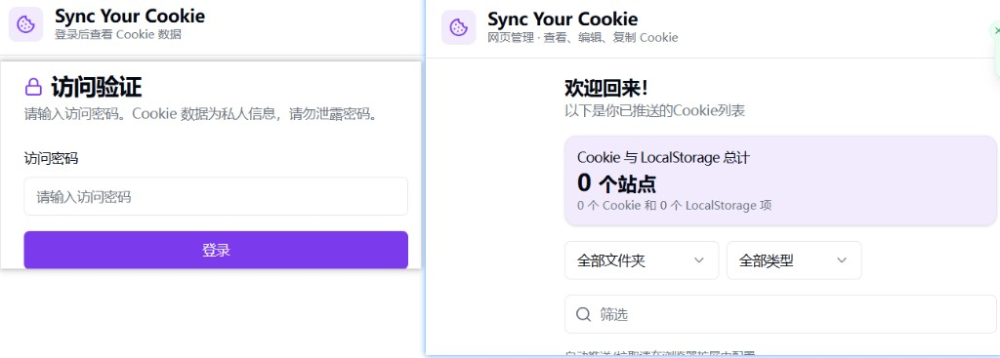

# Cloudflare 部署指南

## 介绍

**Sync Your Cookie** 通过自建的 **Cloudflare Worker + KV** 后端，配合 **Web 管理端**与**浏览器扩展**，在多台设备、多个浏览器之间同步 Cookie 与 LocalStorage。

**解决什么痛点**

- **多设备 / 多浏览器**登录态不一致，换机或换浏览器就要重新登录
- **数据自主**：不依赖第三方 Cookie 同步服务，Cookie 存在你自己 Cloudflare 账号下的 Worker + KV
- **扩展配置简单**（v1.7.x）：只需 **Worker URL + 访问密码**；KV 凭据在 Web 管理端 Connect 表单配置一次即可
- **运维轻量**：Git 连接后 **push 即自动构建部署**
- **同步可控**：支持同站多账号、手动 Push / Pull；多账号推荐 **切换并拉取**（见 [how-to-use.md](../how-to-use.md#使用场景与推荐配置)）

---

## 前置条件

在 Cloudflare Dashboard 创建 Worker 之前，确认：

- [ ] **Cloudflare 账号**，且 GitHub 已授权 Cloudflare
- [ ] 对本仓库 **fork 有 push 权限**（须连接你实际 push 代码的 fork，勿连未同步的上游仓库）
- [ ] 本地或 CI 构建使用 **Node.js 20**（Dashboard **高级设置** 中同样选 20）
- [ ] Worker **项目名称** 填 **`sync-your-cookie`**（须与 `deploy/cloudflare/wrangler.toml` 中 `name` 一致）
- [ ] **Root directory** 填 **`/`**
- [ ] 已按 [前置参数获取](./CLOUDFLARE-PARAMS.md) 准备好 4 个 Build 变量

---

## 前置参数获取

| 参数名称 | 说明 | 是否加密 | 参数来源 |
|----------|------|----------|----------|
| `SYNC_KV_NAMESPACE_ID` | KV 命名空间 ID | 否（Variable） | [图文教程](./CLOUDFLARE-PARAMS.md#创建-kv-命名空间) |
| `CLOUDFLARE_API_TOKEN` | API Token（`cfut_...`） | 是（Secret） | [图文教程](./CLOUDFLARE-PARAMS.md#创建-api-token) |
| `WEB_ACCESS_PASSWORD` | Web / 扩展登录密码 | 是（Secret） | [图文教程](./CLOUDFLARE-PARAMS.md#准备-web-访问密码) |
| `DEPLOY_SEED_DATASOURCE` | 填 `1` 自动配置 Connect | 否（Variable） | 固定填 `1` |

详细步骤与截图见 **[CLOUDFLARE-PARAMS.md](./CLOUDFLARE-PARAMS.md)**。

---

## 部署图文流程

先完成 [前置参数获取](./CLOUDFLARE-PARAMS.md)，进入 Worker 创建页后 **一次性填完** 下表全部项，**再点第一次「部署」**。

| 步骤 | 操作 |
|------|------|
| **1** | 选择 **Git 账户 / 仓库**（须为你 push 代码的 fork，示例 `cf-fork-div/sync-your-cookie`） |
| **2** | **项目名称** 填 **`sync-your-cookie`** |
| **3** | **构建命令**：`pnpm install && pnpm build:cloudflare-worker` |
| **4** | **部署命令**：`node deploy/cloudflare/prepare-wrangler.mjs --deploy` |
| **5** | **高级设置**：Root directory **`/`**，Node.js **20** |
| **6** | Variable **`DEPLOY_SEED_DATASOURCE`** = **`1`** |
| **7** | Secret **`WEB_ACCESS_PASSWORD`** |
| **8** | Variable **`SYNC_KV_NAMESPACE_ID`** |
| **9** | Secret **`CLOUDFLARE_API_TOKEN`** |
| **10** | 点击 **部署**，在 Deployments 页等待 **Build** 与 **Deploy** 均成功 |

---

## 验证

部署成功后按下列清单检查。

### Web 管理端

- [ ] 打开 Worker URL（`https://sync-your-cookie.<子域>.workers.dev` 或你的自定义域名）
- [ ] 用 `WEB_ACCESS_PASSWORD` 登录，进入 Cookie 列表页

- [ ] 若未设置 `DEPLOY_SEED_DATASOURCE=1`：在 **Connect 表单** 填写 Account ID、Namespace ID、API Token 并保存
- [ ] 若设置了 `DEPLOY_SEED_DATASOURCE=1` 且 Deploy 成功：Connect 通常已自动配置

Connect 中的 KV 为 **Cookie 存储**；`SYNC_KV` 存 datasource 等 Worker 元数据（可与 Cookie KV 为同一 Namespace）。

### 自定义域名（可选）

1. Worker → **Settings → Domains & Routes** → **Add Custom Domain**
2. 例如 `sync-your-cookie.example.com`
3. Web 管理端与扩展的 **服务器 URL** 填 `https://sync-your-cookie.example.com`（无尾斜杠）

`workers.dev` 与自定义域名可并存；实际使用哪个地址，扩展与 Web 端填同一个即可。

---

## 下一步

Worker 部署验证通过后，请阅读 **[插件使用指南](../how-to-use.md)**，完成扩展安装、选项页配置与 Push / Pull。
