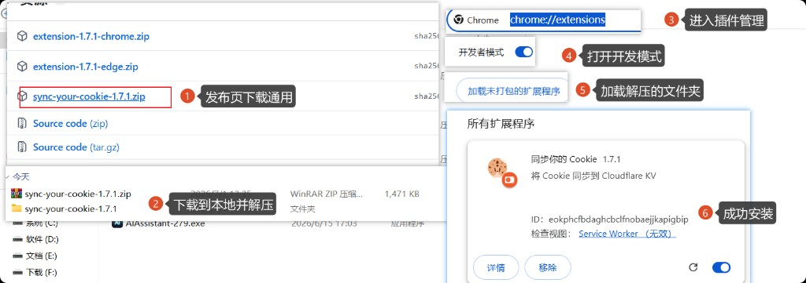
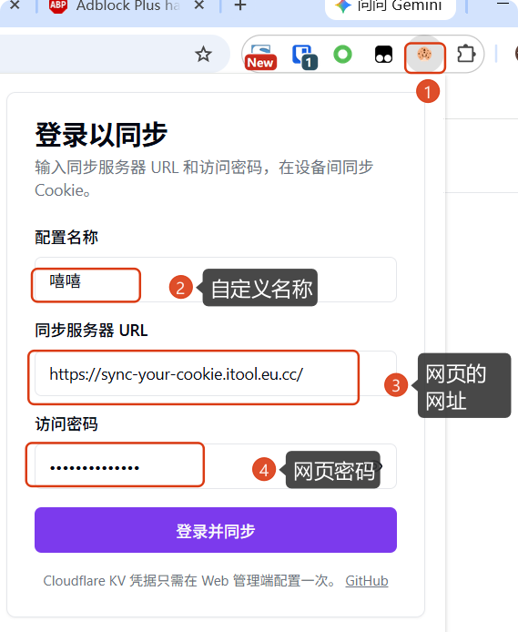

# 插件使用指南

## 插件说明

**Sync Your Cookie** 是一款 Chromium 浏览器扩展，将当前浏览器的 **Cookie** 与 **LocalStorage** 同步到你自建的 **Cloudflare Worker + KV** 后端，从而在多台设备、多个浏览器之间共享登录态。

**能做什么**

- **Push** — 把当前站点的 Cookie（及可选 LocalStorage）上传到云端
- **Pull** — 从云端下载并写入浏览器（镜像同步，完整还原登录态）
- **同站多账号** — 同一域名保存多个账号（如个人号 / 工作号），通过 **切换并拉取** 一键切换
- **Web 管理端** — 与扩展共用同一 Worker 地址，可在网页上查看、编辑已同步的数据

**v1.7.x 连接方式**

扩展只需两项配置：

| 配置项 | 说明 |
|--------|------|
| **服务器 URL** | 已部署的 Worker 地址，如 `https://sync-your-cookie.xxx.workers.dev`（无尾斜杠） |
| **访问密码** | 与 Cloudflare Build 中的 `WEB_ACCESS_PASSWORD` 相同 |

不再需要在扩展里填写 Cloudflare Account ID、Namespace ID 或 API Token（这些仅在 Worker 部署与 Web 管理端 Connect 表单中使用）。

**使用前**

须先按 [Cloudflare 部署指南](./deploy/CLOUDFLARE.md) 完成 Worker 部署；参数准备见 [CLOUDFLARE-PARAMS.md](./deploy/CLOUDFLARE-PARAMS.md)。

---

## 获取与安装

> **本 fork 尚未单独上架商店。** 请从 [GitHub Releases](https://github.com/cf-fork-div/sync-your-cookie/releases) 下载 ZIP 手动加载；开发者可从源码构建，见 [从源码加载](#从源码加载可选)。

打开 [Releases 页面](https://github.com/cf-fork-div/sync-your-cookie/releases)，选择最新版本（如 `v1.7.1`），下载 **`sync-your-cookie-{version}.zip`**（页面也可能提供 `extension-{version}-chrome.zip` 等别名，内容相同）。



| 步骤 | 操作 |
|------|------|
| **1** | 在 Release 页 **Assets** 中下载 `sync-your-cookie-1.7.1.zip` |
| **2** | 保存到本地并 **解压** 到任意文件夹 |
| **3** | 浏览器地址栏打开 `chrome://extensions`（Edge 为 `edge://extensions`） |
| **4** | 开启右上角 **开发者模式** |
| **5** | 点击 **加载已解压的扩展程序**，选择解压后的文件夹（内含 `manifest.json`） |
| **6** | 扩展列表出现 **同步你的 Cookie**，安装成功 |

> 不能将 ZIP 或 CRX 直接拖入扩展页加载；显示「开发者扩展」属正常。更新版本需重新下载 ZIP，在扩展页点击 **重新加载**。

### 从源码加载（可选）

需要最新未发布功能时使用。**环境：** Node.js **20+**、**pnpm**。

```bash
git clone https://github.com/cf-fork-div/sync-your-cookie.git
cd sync-your-cookie
pnpm install
pnpm build
```

构建产物在 **`dist/`**；加载步骤同上（第 3–6 步），选择 **`dist`** 文件夹。修改代码后重新 `pnpm build` 并 **重新加载** 扩展。

---

## 登录扩展

Worker 部署完成后，在扩展中填写连接信息并登录。



| 步骤 | 操作 |
|------|------|
| **1** | 点击工具栏 **Cookie 图标**，打开登录弹窗 |
| **2** | **配置名称** — 自定义显示名，便于区分多套配置（如「工作机」「个人号」） |
| **3** | **同步服务器 URL** — 填 [部署指南](./deploy/CLOUDFLARE.md) 中的 **Worker 地址**（Web 管理端打开的同一网址，无尾斜杠），如 `https://sync-your-cookie.xxx.workers.dev` 或自定义域名 |
| **4** | **访问密码** — 填 Cloudflare Build 中的 **`WEB_ACCESS_PASSWORD`**（与 Web 管理端登录密码相同） |
| **5** | 点击 **登录并同步**，成功后即可 Push / Pull |

KV 凭据（Account ID、Namespace ID、API Token）只需在 **Web 管理端** Connect 表单配置一次；若部署时设置了 `DEPLOY_SEED_DATASOURCE=1`，通常已自动配置。

---

## Push / Pull

- **Push** — 上传当前标签页 Cookie；远程已有数据且不一致时弹出冲突对话框（覆盖或另存为新账号）。
- **Pull** — 下载远程 Cookie；会先清除该 host 的本地 Cookie（镜像同步）。可在弹窗中为每条记录开启 **Auto Pull**。
- **首次 Push** 需填写账号备注（标签）；v1.5.1+ 可在 Push 对话框设置 **文件夹** 与 **类型**（login / session / other）。
- **同域名多账号** — 同一 host 下可保存多条带标签的记录。

---

## 使用场景与推荐配置

### 自动 vs 手动

| 方式 | 适用场景 |
|------|----------|
| **手动 Push / Pull** | 默认推荐；多账号同站、需精确控制同步时机 |
| **Auto Push** | 单账号、登录后 Cookie 会频繁变化且需自动备份 |
| **Auto Pull** | 单账号、新设备/新浏览器首次打开站点时自动还原登录态 |

> 多账号场景优先用手动 + **切换并拉取**，不要依赖 Auto Push / Auto Pull。

### Auto Push 行为

- 监听 Cookie 变化，**10 秒防抖**后 Push（连续变化会重置计时）。
- **非定时**任务，仅在 Cookie 实际变更时触发。
- 同一 host 下若多条记录都开了 Auto Push，**只会同步一条**
  - 优先 `lastSelectedEntryByHost`（弹窗最近选中的账号）
  - 否则同步列表中第一条

### Auto Pull 行为

- 标签页 **首次 loading** 时触发（该 host 无其他已打开标签页）。
- **非定时**任务，不会周期性拉取。
- 同一 host 下若多条记录都开了 Auto Pull，**只会拉取一个**（规则同 Auto Push）。

### 典型场景

| 场景 | 推荐做法 |
|------|----------|
| **单账号站点** | 手动 Push 保存；可选开启 Auto Pull，新浏览器打开站点自动登录 |
| **同站多账号**（如 railgun.info） | 手动 Push 各账号；切换账号用 **切换并拉取**；关闭 Auto Push / Auto Pull |
| **Auto Push 慎用** | 误操作或临时登录可能把错误状态覆盖到云端，影响其他设备 |
| **跨设备共享** | 设备 A Push → 设备 B 手动 Pull 或（单账号时）Auto Pull |

### 推荐全局设置（Options）

| 配置项 | 推荐 | 说明 |
|--------|------|------|
| **服务器 URL + 访问密码** | 必填 | Worker 根地址 + `WEB_ACCESS_PASSWORD`；见 [部署指南](./deploy/CLOUDFLARE.md) |
| **Storage Key** | `sync-your-cookie`（默认） | KV 中的数据键；多配置/多租户时可自定义 |
| **Protobuf 编码** | 开启 | 体积更小、读写更快 |
| **同步 LocalStorage** | 按需 | 站点登录态依赖 localStorage 时开启 |
| **加密** | 按需 | 个人使用可关闭；开启后须记住加密密码 |

### 切换并拉取（多账号）

同站保存了多个账号时，弹窗会显示账号下拉框：

1. 在下拉框中选择目标账号（标签 / 文件夹 / 类型）。
2. 点击 **切换并拉取** — 刷新连接 → 拉取该账号 Cookie → 刷新当前站点标签页。
3. 各账号的 Auto Push / Auto Pull 开关**独立**，在弹窗或侧边栏按条目配置。

> 切换并拉取会覆盖当前浏览器中该 host 的 Cookie（镜像同步），请先确认选中的是正确账号。

---

## 参考

- [Cloudflare 部署指南](./deploy/CLOUDFLARE.md)
- [部署参数获取](./deploy/CLOUDFLARE-PARAMS.md)
- [更新日志](./CHANGELOG.md)
- [商店发布说明](./STORE_PUBLISH.md)
